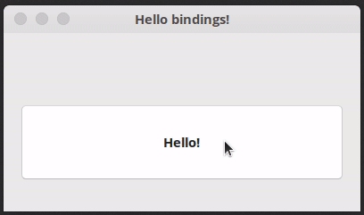

<div align="center">
	
	<h1>gooey</h1>
	<p>
		<b>Declarative UI framework for Go</b>
	</p>
	<br>
	<a href="https://cloud.drone.io/suda/go-gooey"></a>
	<a href="https://goreportcard.com/report/github.com/suda/go-gooey"></a>
	<a href="https://contributionswelcome.org/"></a>
	<a href="https://choosealicense.com/licenses/mit/"></a>
	<br>
	<br>
</div>

#### 🚨 This project is in its beginning and any APIs are subject to change without a notice 🚨
> If you have some ideas, suggestions or generally would like to help, please submit a GitHub Issue and/or PR!

## 🌈 Features

* **Declarative syntax** - think [SwiftUI](https://developer.apple.com/xcode/swiftui/) or [React](https://reactjs.org/) but in Go
* **Component-based** - split your UI into small, fully encapsulated components
* **Powered by GTK3** - leverage a established, stable cross-platform widget toolkit that should work almost everywhere Go can be compiled on

## 📙 Usage

The best way is to look at the [examples](examples). Use `go run` to start them, i.e.:

```
$ go run ./examples/simple
```

### Basic example

```go
// You need to init GTK before anything else
gtk.Init(nil)

// Declare the window
window := Window{
	Title: "Hello go-gooey!",
	// Hook the destroy signal to a callback
	Destroy: func() {
		gtk.MainQuit()
	},
	// Set the default size, otherwise the window will be as big as the initial contents
	DefaultSize: &Size{Width: 400, Height: 200},
	// Describe the window children components
	Children: []Widgetable{
		&Label{
			Text: "👋",
		},
	},
}

// Try opening the window
err := window.Open()
if err != nil {
	log.Fatal("Unable to open window:", err)
}

// Start the GTK main loop
gtk.Main()

```

It should look like this:


### Properties

If you wish to bind a component attribute to a variable, you need to use a `Property` type. It's practically a wrapper around [`RxGo`](https://github.com/ReactiveX/RxGo) observable that allows to subscribe to changes:

```go
// Define a StringProperty
counter := NewStringProperty()

window := Window{
	// ...
	Children: []Widgetable{
		&Box{
			Children: []Widgetable{
				&Label{
					// Assign the property to Text
					Text: *counter,
				},
				&Button{
					Label: "Hello!",
					Clicked: func() {
						// Modify the property value
						counter.Set(counter.Value + " 👋")
					},
				},
			},
		},
	},
}
```

The value changes, immediatelly triger an update on the component:



## 🔍 GTK Inspector

To make the debugging easier, you can use the [GTK Inspector](https://blog.gtk.org/2017/04/05/the-gtk-inspector/) to peek inside of the running app.

## Attributions
* Logo composed from icons by [Hugo Arganda](http://about.me/argandas), Alex Muravev and Ben Davis.